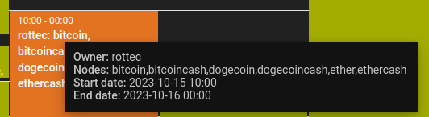

# Testbed Scripts

## Getting Started

### 1. Clone the testbed scripts repository:

```bash
$ cd ~
$ git clone git@gitlab.lrz.de:netintum/teaching/tumi8-theses/masque-theses/testbed-scripts.git testbed-scripts
$ cd testbed-scripts
$ echo "ABCDE123" > gitlab_access_token
$ git checkout crotte && git pull
```

## Setup

### 2. Initialize the testbed:

First, reserve the following nodes: `bitcoin, bitcoincash, dogecoin, dogecoincash, ether, ethercash`:



Then:

```bash
$ cd ~/testbed-scripts
$ yes | python3 setup.py
```

## Network Configuration (Optional)

### 3. Modify the network interface:

Adjust the network settings for the `eno3` interface with 10% packet loss, 1-second RTT, and 1Mbit/s bandwidth.

```bash
$ cd ~/testbed-scripts
$ python3 tc.py \
  bitcoin bitcoincash dogecoin dogecoincash ether ethercash \
  --interface eno3 \
  --packet_loss 10 \
  --rtt 1000 \
  --bandwidth 1
```

### 4. Reset the interface (If Modified):

Reset the changes made to the `eno5` interface.

```bash
$ cd ~/testbed-scripts
$ python3 tc.py \
  bitcoin bitcoincash dogecoin dogecoincash ether ethercash \
  --interface eno5 \
  --reset
```

## Experiments

### 5. Execute Experiments:

Running all experiments might take some time. Results will be saved under `~/logs`.

```bash
$ cd ~/testbed-scripts
$ python3 run_all.py \
  --nodes bitcoin bitcoincash dogecoin dogecoincash ether ethercash \
  --node-addresses-eno5 4.0.0.1 4.0.0.2 4.0.0.3 4.0.0.4 4.0.0.5 4.0.0.6
```

### 6. Plotting:

Generate plots based on the extracted results. Plots will be saved under `~/plots`.

```bash
$ cd ~/testbed-scripts
$ python3 plots.py \
  --results-dir ~/logs \
  --output-dir ~/plots
```
